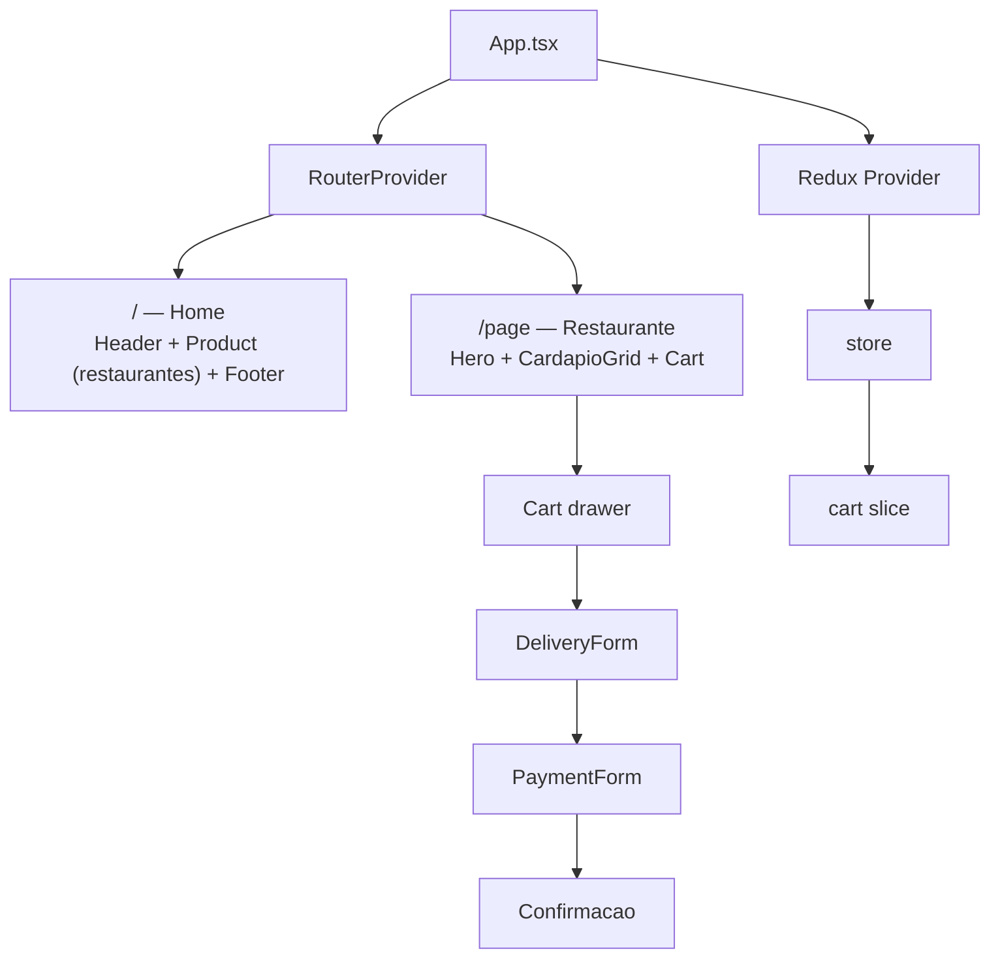

# 🍕 eFood — Delivery de Restaurantes

Aplicação web de delivery de comida inspirada em apps como iFood. O usuário navega por
restaurantes, explora o cardápio, adiciona itens ao carrinho e finaliza o pedido com
dados de entrega e pagamento.


---

## 📋 Sumário

- [Funcionalidades](#-funcionalidades)
- [Tecnologias](#-tecnologias)
- [Pré-requisitos](#-pré-requisitos)
- [Instalação e execução](#-instalação-e-execução)
- [Testes](#-testes)
- [Estrutura do projeto](#-estrutura-do-projeto)
- [Arquitetura e fluxo de dados](#-arquitetura-e-fluxo-de-dados)
- [Rotas](#-rotas)
- [Modelos de dados](#-modelos-de-dados)
- [Qualidade de código](#-qualidade-de-código)
- [Build e deploy](#-build-e-deploy)

---

## ✨ Funcionalidades

- **Listagem de restaurantes** com capa, avaliação, tipo de cozinha e selo de destaque
- **Página do restaurante** com banner (hero) e cardápio em grade
- **Modal de detalhes do prato** com descrição e porção
- **Carrinho lateral (drawer)** com:
  - adição e remoção de itens
  - soma automática de quantidades para itens repetidos
  - cálculo do total em tempo real, formatado em BRL (`Intl.NumberFormat`)
- **Checkout em 3 etapas** dentro do carrinho:
  1. Formulário de **entrega** (nome, endereço, cidade, CEP, número, complemento)
  2. Formulário de **pagamento** (dados do cartão)
  3. Tela de **confirmação** do pedido
- **Validação de formulários** com Formik + Yup (ex.: máscara de CEP `00000-000`)

---

## 🛠 Tecnologias

| Categoria | Tecnologia |
| --- | --- |
| Framework | React 19 + TypeScript |
| Estado global | Redux Toolkit + React Redux |
| Rotas | React Router DOM 7 |
| Estilização | Styled Components |
| Formulários | Formik + Yup |
| Testes unitários | Jest + React Testing Library |
| Testes E2E | Cypress 14 |
| Lint/Formatação | ESLint 9 + Prettier |
| Build | Create React App (react-scripts 5) |

---

## 📦 Pré-requisitos

- **Node.js** 18 ou superior
- **npm** 9 ou superior

---

## 🚀 Instalação e execução

```bash
# 1. Clone o repositório
git clone https://github.com/PauloHenrique993940/efood.git
cd efood

# 2. Instale as dependências
npm install

# 3. Rode em modo desenvolvimento (http://localhost:3000)
npm start

# 4. Gere o build de produção (pasta build/)
npm run build
```

---

## 🧪 Testes

### Testes unitários (Jest + React Testing Library)

O Jest já vem configurado pelo Create React App. Os testes ficam em arquivos
`*.test.ts` / `*.test.tsx` próximos ao código
(ex.: [src/store/reducers/cart.test.ts](src/store/reducers/cart.test.ts)).

```bash
# Modo watch (desenvolvimento)
npm test

# Execução única com relatório de cobertura (CI)
npm run test:ci
```

### Testes E2E (Cypress)

Os specs ficam em `cypress/e2e/` e a configuração em [cypress.config.ts](cypress.config.ts)
(baseUrl: `http://localhost:3000`).

```bash
# 1. Suba a aplicação em um terminal
npm start

# 2. Em outro terminal, abra a interface do Cypress...
npm run cypress:open

# ...ou rode em modo headless (CI)
npm run cypress:run

# Atalho: sobe o servidor, espera e roda o Cypress automaticamente
npm run e2e
```

---

## 📁 Estrutura do projeto

```
efood/
├── public/                     # Arquivos estáticos (index.html, manifest, data.json)
├── cypress/
│   ├── e2e/home.cy.ts          # Specs E2E
│   ├── support/                # Comandos customizados e setup do Cypress
│   └── tsconfig.json           # Tipos isolados do Cypress (evita conflito com Jest)
├── src/
│   ├── App.tsx                 # Rotas e providers (Redux + Router + CSS global)
│   ├── index.tsx               # Entry point
│   ├── styles.ts               # CSS global e paleta de cores
│   ├── asstes/                 # Imagens (logo, pratos, pizzas, ícones)
│   ├── components/
│   │   ├── Banner/             # Hero da página do restaurante
│   │   ├── Button/             # Botão reutilizável
│   │   ├── Cards/              # Grade do cardápio + Modal de detalhes do prato
│   │   ├── Cart/               # Drawer do carrinho
│   │   │   ├── index.tsx           # Lista de itens, total e orquestração do checkout
│   │   │   ├── DeliveryForm.tsx    # Etapa 1 — dados de entrega (Formik + Yup)
│   │   │   ├── PaymentForm.tsx     # Etapa 2 — dados de pagamento
│   │   │   └── confirm/            # Etapa 3 — confirmação do pedido
│   │   ├── Footer/             # Rodapé
│   │   ├── Header/             # Cabeçalho da home (logo + slogan)
│   │   ├── Product/            # Cards de restaurantes na home
│   │   └── Tag/                # Etiquetas (tipo de cozinha, destaque)
│   ├── data/
│   │   └── restaurants.ts      # Catálogo de restaurantes e cardápios (mock)
│   ├── pages/
│   │   ├── page.tsx            # Página do restaurante (cardápio + carrinho)
│   │   └── DeliveryPage/       # Página de entrega
│   └── store/
│       ├── index.ts            # Configuração da store Redux
│       └── reducers/
│           ├── cart.ts         # Slice do carrinho (add/remove/open/close)
│           └── cart.test.ts    # Testes unitários do slice
├── cypress.config.ts           # Configuração do Cypress (baseUrl: localhost:3000)
├── eslint.config.mjs           # ESLint flat config
├── tsconfig.json               # Configuração TypeScript do app
└── package.json
```

---

## 🏗 Arquitetura e fluxo de dados



### Estado global (Redux Toolkit)

O slice do carrinho ([src/store/reducers/cart.ts](src/store/reducers/cart.ts)) expõe:

| Ação | Payload | Efeito |
| --- | --- | --- |
| `openCart` | — | Abre o drawer do carrinho (`isOpen: true`) |
| `closeCart` | — | Fecha o drawer |
| `addItem` | `CartItem` | Adiciona o item; se o `id` já existe, soma a `quantity` |
| `removeItem` | `id: number` | Remove o item do carrinho |

O total é derivado com `reduce` sobre `items` (`price * quantity`) e formatado em BRL.

---

## 🗺 Rotas

| Rota | Componente | Descrição |
| --- | --- | --- |
| `/` | Home | Lista de restaurantes (`Product`) com header e footer |
| `/page` | `Page` | Página do restaurante: banner, cardápio e carrinho |

---

## 📄 Modelos de dados

```ts
// Restaurante e cardápio (src/data/restaurants.ts)
interface Restaurant {
  id: number;
  titulo: string;
  destacado: boolean;
  tipo: string;          // ex.: "Japonesa", "Italiana"
  avaliacao: number;     // ex.: 4.9
  descricao: string;
  capa: string;
  capaDestaque: string;
  cardapio: MenuItem[];
}

interface MenuItem {
  id: number;
  nome: string;
  descricao: string;
  porcao: string;
  preco: number;
  foto: string;
}

// Item do carrinho (src/store/reducers/cart.ts)
interface CartItem {
  id: number;
  name: string;
  price: number;
  quantity: number;
  image: string;
}
```

> **Nota:** atualmente os dados vêm de um mock local ([src/data/restaurants.ts](src/data/restaurants.ts)).
> A dependência `axios` já está instalada para uma futura integração com API REST.

---

## 🧹 Qualidade de código

- **ESLint** (flat config em [eslint.config.mjs](eslint.config.mjs)) com regras de React e TypeScript
- **Prettier** integrado ao ESLint
- **TypeScript** em modo `strict`

```bash
npx eslint .              # lint de todo o projeto
npx prettier --check .    # verifica formatação
```

---

## 🚢 Build e deploy

```bash
npm run build
```

O build de produção é gerado na pasta `build/`, já minificado e com hashes nos arquivos.
A pasta pode ser publicada em qualquer hosting estático (Vercel, Netlify, GitHub Pages, S3 etc.).

---

## 👤 Autor

**Paulo Henrique** — [github.com/PauloHenrique993940](https://github.com/PauloHenrique993940)
